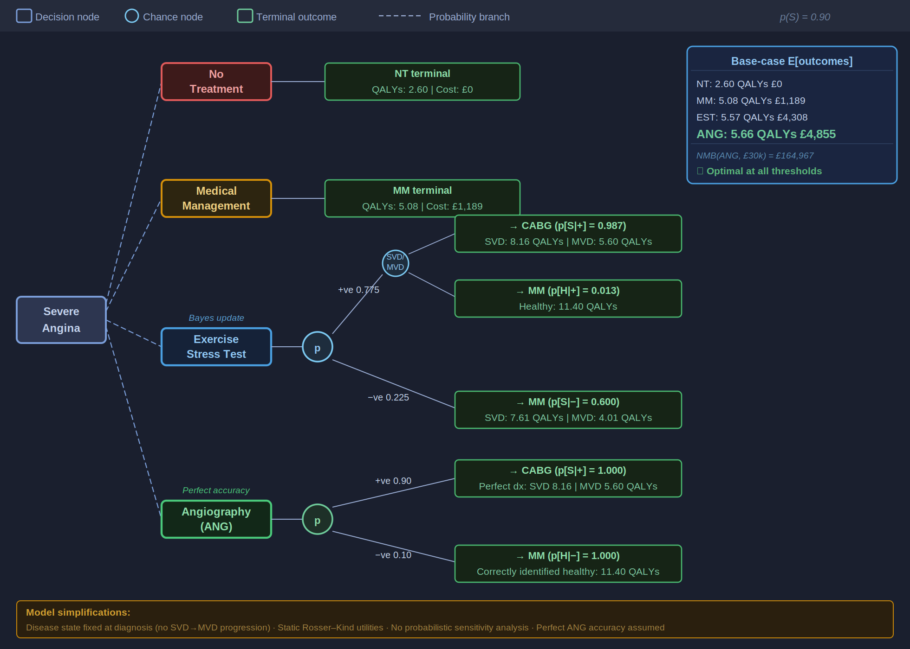
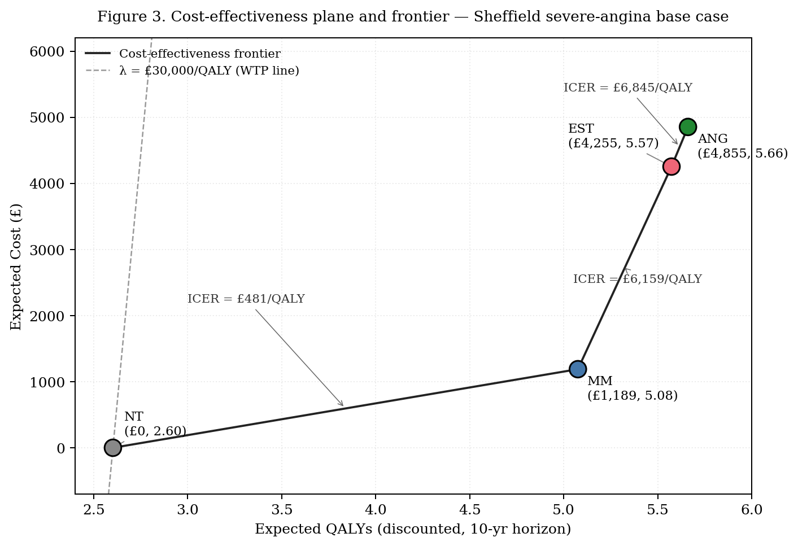
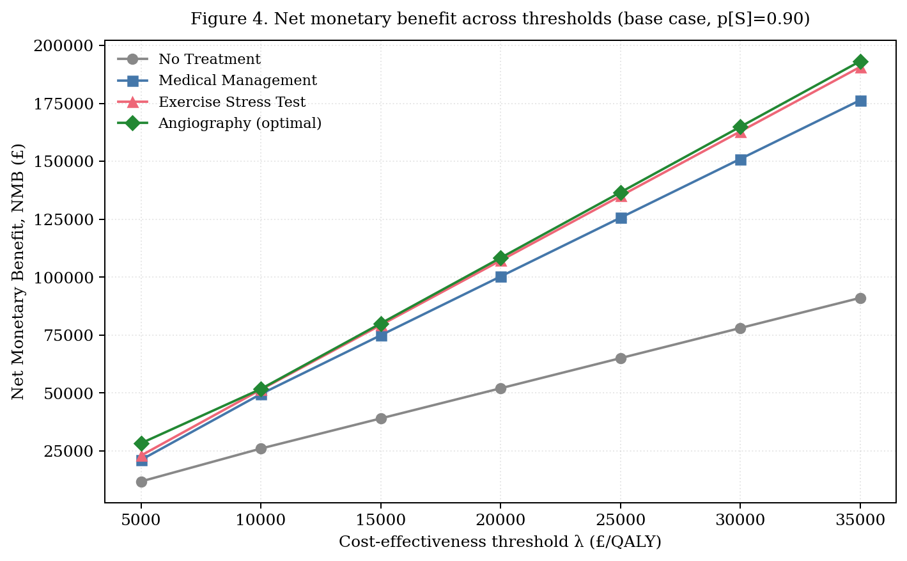
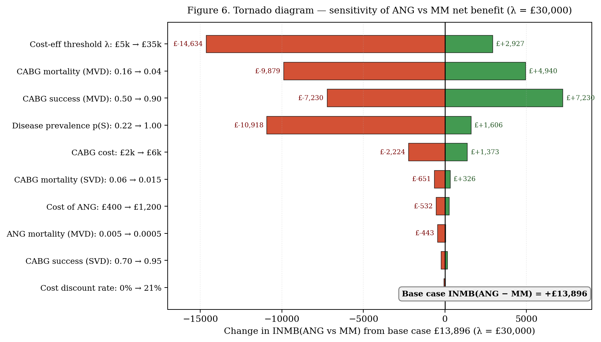
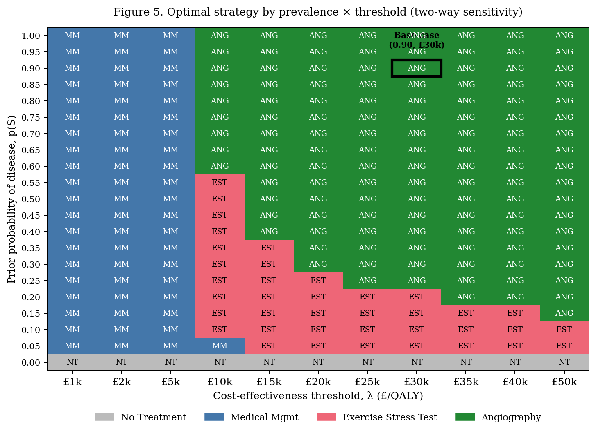
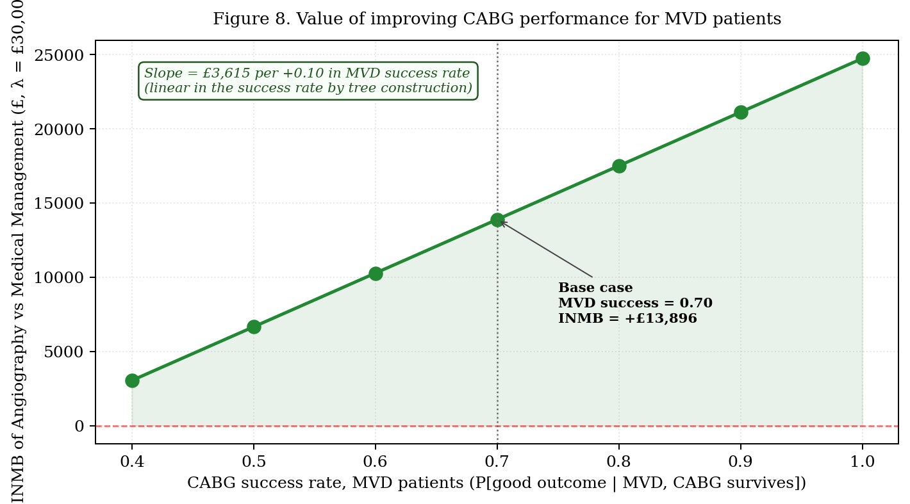

# 🫀 Health Technology Assessment - Cost-Effectiveness of Diagnostic & Treatment Strategies for Severe Angina

[](report/HTA_Report_Severe_Angina.pdf)
[]()
[]()
[]()
[]()
[](https://github.com/harshithaManjunath-ux/Decision-Tree-Model)

A full **Health Technology Assessment (HTA) report** evaluating whether a Sheffield cardiology department should investigate and treat severe-angina referrals with **no treatment, medical management, exercise stress testing, or direct coronary angiography**, written to NICE reference-case standards and awarded a **distinction**.

This repository is the **written analysis and communication** layer of the project. The underlying **Excel decision-analytic model** lives in its companion repository:
👉 **[harshithaManjunath-ux/Decision-Tree-Model](https://github.com/harshithaManjunath-ux/Decision-Tree-Model)** - the fully-formula-based workbook (decision tree, ICER calculations, sensitivity analyses).

> ### 🎯 Headline result
> **Direct coronary angiography maximises net monetary benefit at every cost-effectiveness threshold in the plausible UK range.** Its incremental net benefit over medical management is **+£13,896 at λ = £30,000/QALY**, and the recommendation stays positive down to **λ ≈ £6,232/QALY** - well below any defensible NHS threshold. The recommendation survives *every* single-parameter perturbation except a simultaneous collapse of both disease prevalence and willingness-to-pay.

> 📄 **[Read the full report (PDF)](report/HTA_Report_Severe_Angina.pdf)** - 22 pages, 8 figures, 4 appendices.

---

## 📑 Contents

- [Why this project](#-why-this-project)
- [The decision problem](#-the-decision-problem)
- [How the model works](#-how-the-model-works)
- [Results](#-results)
- [Does the recommendation survive uncertainty?](#-does-the-recommendation-survive-uncertainty)
- [Research questions & answers](#-research-questions--answers)
- [What this project demonstrates](#-what-this-project-demonstrates)
- [Repository structure](#-repository-structure)
- [Methods at a glance](#-methods-at-a-glance)
- [References](#-references)

---

## 💡 Why this project

Health technology assessment turns a clinical question, *how should we investigate this patient?*  into an **economic one**: every pound spent on diagnosis or surgery displaces health that could have been generated elsewhere in a capacity-constrained NHS. This report works that problem end-to-end:

- It frames a **real commissioning decision** from a Sheffield cardiology department's perspective.
- It builds a **transparent decision-analytic model** and folds it back to expected costs, QALYs, and net monetary benefit.
- It stress-tests the recommendation with **one-way, two-way, and value-of-improvement** analyses.
- It communicates the whole thing to a **decision-maker**, not just a marker with an executive summary, explicit assumptions, and a policy implication.

The companion repository holds the *machinery*; this repository holds the *argument*.

---

## 🩺 The decision problem

A Sheffield cardiology department must decide how to investigate and treat **male patients aged 55 referred with typical severe exertional angina** (prior probability of obstructive coronary artery disease, *p(S)* = 0.90). Four mutually exclusive strategies are compared:

| Strategy | What it does | Trade-off |
|---|---|---|
| **No Treatment (NT)** | Baseline - no diagnosis, no active treatment | Cheapest; worst health |
| **Medical Management (MM)** | Treat without formal diagnosis | Low cost, no targeting |
| **Exercise Stress Test (EST)** | Non-invasive, *imperfect* test → conditional treatment | Cheap information, but false negatives delay treatment and false positives trigger unnecessary surgery |
| **Coronary Angiography (ANG)** | Invasive, near-*perfect* test → conditional treatment | Precise information, higher cost and small procedural risk |

The central tension is **diagnostic precision versus resource efficiency**. That is exactly the tension the model quantifies.

---

## 🌳 How the model works

The clinical pathway is a finite, irreversible sequence of decisions with outcomes governed by discrete chance events (disease type, test result, surgical outcome), so a **decision tree** is the analytically sufficient, transparent structure. For the two diagnostic arms, **Bayes' theorem** updates the prior probability of disease conditional on the test result; those posteriors drive the downstream treatment choice. Every terminal node is weighted by its probability, cost, and QALYs, and the tree is folded back to the strategy with the highest net monetary benefit.

<p align="center">
  
</p>

<p align="center"><em>Figure 1 - Simplified decision tree. Decision nodes (squares) are choices; chance nodes (circles) are probabilistic events. Terminal outcomes show base-case expected QALYs and costs; NMB is calculated at λ = £30,000. Full unfolded structure in the report's Appendix A.</em></p>

**Outcomes** are quality-adjusted life-years from the Rosser–Kind matrix, discounted at 3.5% per annum. **Costs** are direct NHS unit costs from the Sheffield case study, discounted over a 10–15 year horizon. The **decision rule** is net monetary benefit, `NMB(s, λ) = λ · E[QALYs] − E[Costs]`, chosen over incremental ICERs because it collapses a four-strategy comparison into a single ranking without error-prone dominance logic.

Every structural simplification is stated with its **direction of bias**, static disease states (biases *against* angiography), perfect angiography (biases *for* it), Rosser–Kind utilities, and the absence of PSA - so the reader knows exactly which way each assumption pushes the result.

---

## 📊 Results

At base-case values all four strategies lie on the **cost-effectiveness frontier** - none is dominated. Angiography is the most effective and most costly, and every step up the frontier is cost-effective at any plausible UK threshold.

| Strategy | Expected cost | Expected QALYs | Incremental ICER |
|---|---:|---:|---:|
| No Treatment (NT) | £0 | 2.602 | - |
| Medical Management (MM) | £1,189 | 5.075 | £481 / QALY |
| Exercise Stress Test (EST) | £4,255 | 5.573 | £6,159 / QALY |
| **Angiography (ANG)** | **£4,855** | **5.661** | **£6,845 / QALY** |

<p align="center">
  
  
</p>

<p align="center"><em>Left - the cost-effectiveness plane: all four strategies sit on the frontier, and every segment is flatter than the willingness-to-pay line. Right - net monetary benefit by threshold: angiography (green) is the upper envelope across the entire plausible UK range.</em></p>

The frontier reveals a subtle structural feature: the ICER of ANG vs EST (£6,845) is almost identical to that of EST vs MM (£6,159). Once a decision-maker is willing to fund EST, moving to angiography is *essentially the same value-for-money trade-off, not a more demanding one*.

---

## 🔍 Does the recommendation survive uncertainty?

A decision model earns its keep not through the precision of a single point estimate, but through whether its **policy implication holds across the range of plausible parameter values**. The report interrogates the angiography recommendation along three axes.

### One-way sensitivity - what actually moves the result?

<p align="center">
  
</p>

<p align="center"><em>Figure - tornado diagram: change in incremental net benefit of ANG vs MM when each parameter is varied across its plausible range.</em></p>

Three findings are worth flagging:

1. **The model is more sensitive to surgical performance than to diagnostic strategy.** Angiography's advantage is entirely the QALYs delivered by the surgery it enables, so CABG mortality and success in MVD patients dominate the tornado, not the diagnostic parameters.
2. **EST sensitivity and specificity have essentially zero effect** on the headline comparison, a cleaner reading than treating test accuracy as the driver.
3. The **QALY discount rate** can rise to ~12–13% (versus the 3.5% NICE rate) before the recommendation weakens.

### Two-way sensitivity - heterogeneity as a feature, not a bug

<p align="center">
  
</p>

<p align="center"><em>Figure - optimal strategy across the prevalence × threshold grid. The Sheffield base case (p(S) = 0.90, λ = £30k) sits deep inside the angiography-optimal region.</em></p>

This surface doubles as a **heterogeneity analysis**: the *same* decision tree yields different recommendations for different patient mixes. Severe-angina referrals sit deep in the angiography region; moderate-angina referrals sit near the EST/ANG boundary; low-prevalence screening populations fall into medical management. For the base case to flip to MM, both prevalence and threshold would have to collapse to roughly *p(S) ≤ 0.05 and λ ≤ £5,000* simultaneously outside any plausible Sheffield scenario.

### Value of improvement - where should the department invest?

<p align="center">
  
</p>

The NMB framework translates parameter improvements directly into **pounds a regulator should be willing to invest**. Raising MVD CABG success from 0.70 to 0.80 is worth ≈ **£3,615 per +0.10** in success rate, roughly **£723,000 per year** for a department running ~200 severe-angina CABG cases annually. The general principle: *returns are largest where the parameter sits in the active part of the decision surface, improving the surgery angiography delivers pays back far more than improving a diagnostic test already off the frontier.*

---

## ❓ Research questions & answers

| # | Research question | Answer |
|---|---|---|
| **RQ1** | Which strategy is cost-effective for the Sheffield cohort across the plausible threshold range? | **Angiography, at every threshold** - INMB over MM ranges +£7,235 to +£16,822. |
| **RQ2** | At what prevalence × threshold combination does the optimum switch? | The base case sits *deep* inside the ANG region; a flip needs *p(S) ≈ 0.05 and λ ≈ £5,000* together. |
| **RQ3** | Is there economic value in improving EST accuracy? | Little EST is off the frontier. The return to better **CABG** (£3,615 / +0.10) far exceeds better EST (£1,380 / +0.10). |
| **RQ4** | Is the conclusion robust to the discount rate and the perfect-angiography assumption? | Yes, it survives QALY discount rates to ~12–13% and a relaxed accuracy assumption; it does *not* survive a joint threshold-and-prevalence collapse (the lower-income-setting scenario). |

---

## 🎓 What this project demonstrates

This report is deliberately structured to show the full HEOR skill set, from framing to communication:

- **Decision-analytic modelling** - decision-tree construction, fold-back expected-value analysis, and explicit treatment of structural assumptions and their direction of bias.
- **Bayesian reasoning** - deriving posterior probabilities of disease from test sensitivity/specificity to drive conditional treatment decisions (report Appendix D).
- **Cost-effectiveness analysis** - QALY estimation, discounting to the NICE reference case, the ICER frontier with dominance checks, and net-monetary-benefit decision rules.
- **Uncertainty analysis** - one-way (tornado), two-way (decision-surface heatmap), heterogeneity, transferability, and value-of-improvement analyses.
- **Methodological judgement** - choosing NMB over ICERs, flagging Rosser–Kind vs EQ-5D, and honestly scoping what a Markov extension and PSA would add.
- **Communication to stakeholders** - an executive summary, a reader's guide, a clean policy implication, and figures a commissioner can read at a glance.

---

## 📁 Repository structure

```
severe-angina-hta/
│
├── README.md                        ← you are here
├── report/
│   └── HTA_Report_Severe_Angina.pdf ← the full distinction report (22 pp)
│
├── figures/                         ← all 8 report figures, full resolution
│   ├── fig1-decision-tree.png
│   ├── fig2-markov-states.png
│   ├── fig3-ce-plane.png
│   ├── fig4-nmb-thresholds.png
│   ├── fig5-tornado.png
│   ├── fig6-prevalence-sensitivity.png
│   ├── fig7-strategy-heatmap.png
│   └── fig8-value-of-improvement.png
│
├── docs/                            ← the analysis, broken out as readable notes
│   ├── 01-decision-problem.md
│   ├── 02-methods.md
│   ├── 03-results.md
│   ├── 04-sensitivity-analysis.md
│   ├── 05-discussion-and-limitations.md
│   └── parameters.md                ← full parameter table with sensitivity ranges & sources
│
├── CITATION.cff
└── LICENSE
```

> 🔗 **Companion model repository:** [harshithaManjunath-ux/Decision-Tree-Model](https://github.com/harshithaManjunath-ux/Decision-Tree-Model) - the Excel workbook this report is built on.

---

## 🛠️ Methods at a glance

| Element | Choice | Basis |
|---|---|---|
| Model type | Decision tree (fold-back) | Finite, irreversible pathway; NICE DSU TSD 13 |
| Probability revision | Bayes' theorem | EST posteriors (report Appendix D) |
| Outcome measure | QALYs - Rosser–Kind index | Kind, Rosser & Williams (1982) |
| Discounting | 3.5% p.a. on costs *and* QALYs | NICE reference case (PMG36) |
| Decision rule | Net Monetary Benefit | Stinnett & Mullahy (1998) |
| Threshold range | £5,000 – £35,000 / QALY | NICE range + Claxton et al. (2015) opportunity-cost estimate |
| Uncertainty | 1-way, 2-way, VOI, transferability | NICE DSU best-practice |
| Software | Microsoft Excel - fully formula-based, no macros | Transparent & auditable |

---

## 📚 References

- Briggs, A., Claxton, K. & Sculpher, M. (2006). *Decision Modelling for Health Economic Evaluation.* Oxford University Press.
- Claxton, K. et al. (2015). 'Methods for the estimation of the NICE cost-effectiveness threshold.' *Health Technology Assessment*, 19(14), 1–503.
- Kaltenthaler, E. et al. (2011). *NICE DSU Technical Support Document 13.* NICE Decision Support Unit.
- Kind, P., Rosser, R. & Williams, A. (1982). 'Valuation of quality of life: some psychometric evidence', in *The Value of Life and Safety.* North-Holland, 159–170.
- NICE (2022). *Health Technology Evaluations: The Manual (PMG36).* London: NICE.
- Stinnett, A.A. & Mullahy, J. (1998). 'Net health benefits.' *Medical Decision Making*, 18(2 Suppl), S68–S80.
- Walker, S. et al. (2013). 'Cost-effectiveness of cardiovascular magnetic resonance in the diagnosis of coronary heart disease (CE-MARC).' *Heart*, 99(12), 873–881.

---

## 👤 Author

**Harshitha Manjunath**
Built for the module *Decision Modelling for Health Economic Evaluation (ECO00088M)* - awarded a distinction.

*This repository presents academic coursework for portfolio purposes. Unit costs and probabilities are drawn from a teaching case study and are not intended for clinical or commissioning use.*
