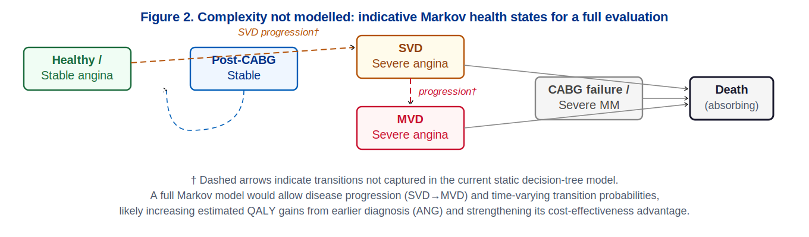

# 2 · Analytical Framework

[← Decision problem](01-decision-problem.md) · [Back to README](../README.md) · [Next: Results →](03-results.md)

---

## Why a decision tree

The model follows the staged approach set out by the NICE Decision Support Unit — understanding the decision problem, conceptual modelling, implementation, checking, and engaging with the decision (Kaltenthaler et al., 2011). A **decision-tree framework** was selected because three features of the Sheffield problem fit the structure:

1. the clinical pathway is a **finite, irreversible** sequence of decisions;
2. outcomes are determined by a **discrete set of chance events** (disease type, test result, surgical outcome); and
3. the comparison does **not** require modelling recurring state transitions over an open-ended horizon.

A Markov model would capture long-term disease progression and cyclical health states and is recommended for any future full evaluation. For comparing diagnostic strategies over a 10–15 year horizon, however, the decision tree is analytically sufficient, transparent, and clearly communicable to decision-makers.

> **Key assumption.** Disease status is fixed at the point of diagnosis; the model captures neither progression from SVD to MVD nor spontaneous recovery — likely *understating* the long-term QALY gains from earlier, more accurate diagnosis.

## Model structure

The model evaluates four mutually exclusive strategies at the initial decision node. For the EST and ANG arms, **Bayesian updating** derives the posterior probability of disease conditional on the test result; these predictive values govern the subsequent treatment decision. All strategies then branch to treatment (CABG or MM) and to terminal survival or death, stratified by disease type. The tree is folded back by weighting each terminal node by its probability, cost, and QALY value and summing across branches; the strategy with the highest net monetary benefit at a given λ is identified as cost-effective.


## Model simplifications and their direction of bias

Following best-practice criteria that structural assumptions be explicitly documented and justified (Kaltenthaler et al., 2011), each simplification is stated with its direction of bias.

| Simplification | What it assumes | Direction of bias |
|---|---|---|
| **(i) Static disease states** | Severity fixed at diagnosis; no SVD→MVD progression | Favours NT/MM; *understates* ANG's advantage at longer horizons. A Markov model would correct this. |
| **(ii) Perfect angiography** | ANG sensitivity = specificity = 1.0 | *Overstates* ANG's QALY gain (real-world ≈ 0.95–0.99); explored in sensitivity analysis. |
| **(iii) Rosser–Kind utilities** | Utilities predate EQ-5D, now the NICE standard | Tend to be higher in moderate disability states; net bias uncertain but likely small relative to (i)–(ii). |
| **(iv) No probabilistic sensitivity analysis** | Uncertainty explored deterministically | Reflects absence of distributional information; robustness across the full deterministic space gives reasonable confidence PSA would not reverse the finding. |



*A full Markov model would allow disease progression (SVD→MVD) and time-varying transition probabilities, likely increasing estimated QALY gains from earlier diagnosis (ANG) and strengthening its cost-effectiveness advantage.*

## Health outcome measurement

Outcomes are expressed in **quality-adjusted life-years (QALYs)**, with utilities sourced from the Rosser–Kind matrix mapping eight disability and four distress levels onto a 0–1 cardinal scale (Kind, Rosser & Williams, 1982). The current NICE reference standard is EQ-5D with UK tariffs (NICE, 2022); Rosser–Kind tends to assign higher utility to moderate disability states than EQ-5D, so absolute QALY totals are likely modestly inflated — but the *differences* between strategies, the quantities driving the recommendation, are far less affected.

## Decision rule and threshold

The primary decision rule is **net monetary benefit**:

```
NMB(s, λ) = λ · E[QALYs] − E[Costs]
```

with the optimal strategy maximising NMB at a given λ. NMB is preferred to the ICER because the four-strategy comparison requires sequential exclusion of dominated and extended-dominated options before ICERs can be formed — a procedure that is error-prone when strategies are close in effectiveness — and because NMB is additive and computable directly from expected values, enabling straightforward sensitivity analysis.

Results are reported across **λ = £5,000–£35,000**, deliberately including values below the NICE reference range (£20,000–£30,000) that more plausibly reflect health opportunity cost (≈£12,936/QALY; Claxton et al., 2015).

## Discounting

Costs and outcomes are discounted at **3.5% per annum**, consistent with the NICE reference case (NICE, 2022), using `1/(1 + r)^t` where r = 0.035.

## Bayesian revision (EST arm)

The EST arm updates the prior probability of disease based on the test result. Using the base-case inputs (prior p(S) = 0.90, sensitivity 0.85, specificity 0.90):

| Step | Calculation | Result |
|---|---|---|
| Marginal P(EST+) | (0.85 × 0.90) + (0.10 × 0.10) | 0.775 |
| Marginal P(EST−) | (0.15 × 0.90) + (0.90 × 0.10) | 0.225 |
| Posterior P(S \| EST+) | 0.765 / 0.775 | **0.987** |
| Posterior P(S \| EST−) | 0.135 / 0.225 | **0.600** |

The residual 0.600 probability of disease *after a negative test* is what makes EST an imperfect triage tool — a negative result does not rule disease out, which is precisely why the model routes test-negative patients to medical management rather than discharge. (Full derivation in the report's Appendix D.)

---

[← Decision problem](01-decision-problem.md) · [Back to README](../README.md) · [Next: Results →](03-results.md)
