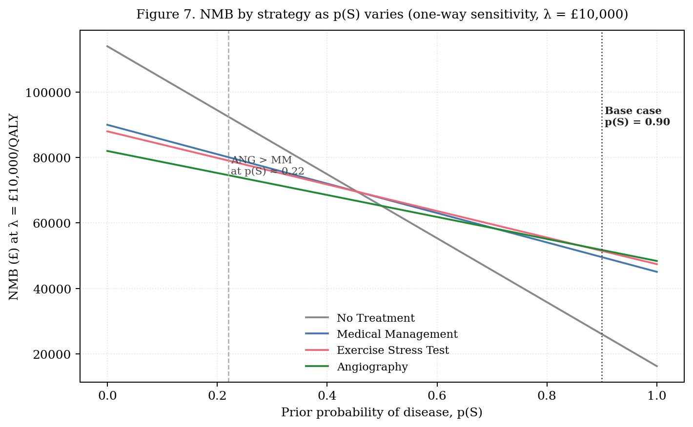

# 4 · Sensitivity Analysis

[← Results](03-results.md) · [Back to README](../README.md) · [Next: Discussion →](05-discussion-and-limitations.md)

---

A good decision model is judged not by the precision of its base-case point estimate but by whether its policy implication holds across the range of plausible parameter values (Kaltenthaler et al., 2011). This section interrogates the angiography recommendation along three axes: **one-way deterministic sensitivity** (parameter uncertainty), **two-way sensitivity** (joint uncertainty and population heterogeneity), and a **value-of-improvement analysis** that uses the NMB framework to quantify the return on investing in better surgical performance.

## One-way sensitivity — which parameters move the recommendation?

The tornado diagram shows the change in INMB(ANG − MM) at λ = £30,000 when each parameter is varied across a plausible range with all others held at base case. Bars are ranked by total swing.

Four parameters dominate: the cost-effectiveness threshold itself, CABG mortality in MVD patients, CABG success rate in MVD patients, and disease prevalence p(S). Three results are worth flagging.

**1 · The model is more sensitive to surgical performance than to diagnostic strategy.** Raising MVD CABG mortality from 0.08 to 0.16 reduces INMB(ANG − MM) by ≈£9,900, and dropping MVD success from 0.70 to 0.50 reduces it by ≈£7,200. This is intuitive: angiography's advantage over MM is entirely the QALYs delivered by the surgery it enables, so *the quality of the surgery is what the recommendation truly rests on*.

**2 · EST sensitivity and specificity have zero effect on INMB(ANG − MM)** — because neither ANG nor MM uses the EST. The correct comparator for EST parameters is the ANG–EST gap. At base case, INMB(ANG − EST) at λ = £30,000 is +£2,029; raising EST sensitivity from 0.85 to 1.00 collapses this to ≈£0 (a perfect EST would essentially tie with ANG), while dropping it to 0.70 widens the gap to £4,123. EST specificity barely matters (±£20). This is a cleaner reading than treating EST parameters as drivers of the headline result.

**3 · The QALY discount rate has limited influence.** ANG remains optimal at λ = £30,000 for QALY discount rates up to approximately 12–13%, well above the 3.5% NICE reference rate, because most of ANG's QALY gain accrues in the first 5–10 years. The cost discount rate moves INMB by less than £50 across the full 0%–21% range.

As prevalence varies at λ = £10,000, **ANG overtakes MM at a break-even prevalence of p(S) ≈ 0.22** — well below the Sheffield value of 0.90 and below the prior for moderate angina (0.60). Equivalently, holding p(S) at base case, ANG remains optimal at every λ ≥ £6,232/QALY.

## Two-way sensitivity — heterogeneity and the decision surface

The heatmap maps the optimal strategy across the full prevalence × threshold grid. Four regions emerge: NT is optimal only at p(S) = 0; MM dominates a low-prevalence, low-threshold band; EST occupies a narrow transitional region; and ANG fills the upper-right quadrant of high prevalence and/or high threshold.

The Sheffield base case sits **deep within the ANG region — three rows and four columns inside the boundary.** For the recommendation to flip to MM, both prevalence and threshold would need to fall simultaneously to roughly p(S) ≤ 0.05 and λ ≤ £5,000.

**Heterogeneity.** This grid is also the heterogeneity analysis: the same model can be re-read as comparing distinct patient populations. Severe-angina referrals (p(S) = 0.90) sit in the deep-ANG region; moderate-angina referrals (p(S) = 0.60) sit just inside the ANG region at NICE thresholds but on the EST/ANG boundary at lower thresholds; asymptomatic screening populations (p(S) < 0.10) sit firmly in the MM region. The *same decision tree therefore yields different recommendations for different patient mixes — a feature, not a bug, of the modelling framework.*

## Value of improvement — return on better surgery

Decision models earn their keep not only by ranking existing strategies but by valuing *potential improvements* to them. The NMB framework translates parameter improvements directly into pounds — the maximum a regulator should be willing to invest.

INMB(ANG − MM) is **linear in the MVD CABG success rate by the tree's construction**, with a slope of **£3,615 per +0.10** in success rate. For a cardiology department running ~200 severe-angina CABG cases annually, an intervention raising MVD success from 0.70 to 0.80 (one absolute decile) would generate roughly **£723,000 in net monetary benefit per year** — a defensible upper bound on what the department should be willing to spend on such an intervention. The general principle: *returns to investment are largest where the parameter sits in the active part of the decision surface. Improving CABG (the treatment ANG delivers) pays back far more than improving EST (a comparator already off the frontier)* — approximately £3,615 per +0.10 in CABG success versus ≈£1,380 per +0.10 in EST sensitivity.

## Transferability — lower-threshold settings

Below approximately £6,232/QALY — a threshold range relevant to lower-middle-income systems and consistent with WHO-CHOICE opportunity-cost estimates for several LMICs — the heatmap shows **MM becoming optimal** across the prevalence range up to p(S) ≈ 0.50, with EST occupying the transitional band as a capacity-conserving triage tool where catheterisation is scarce. The structural conclusion that angiography is justified at high prevalence survives, but the prevalence required to justify it rises sharply. A full transferability assessment would re-estimate local unit costs and CABG mortality.

## Limits of the deterministic approach

Probabilistic sensitivity analysis (PSA) was not undertaken because no distributional information was provided for the input parameters. Were PSA conducted with plausible distributions, the cost-effectiveness acceptability curve at λ = £30,000 would almost certainly show ANG optimal in the substantial majority of simulations, given that the deterministic INMB(ANG − MM) is +£13,896 and survives all single-parameter perturbations except extreme p(S) reductions.

---

[← Results](03-results.md) · [Back to README](../README.md) · [Next: Discussion →](05-discussion-and-limitations.md)
